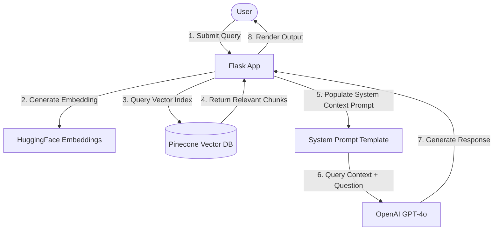
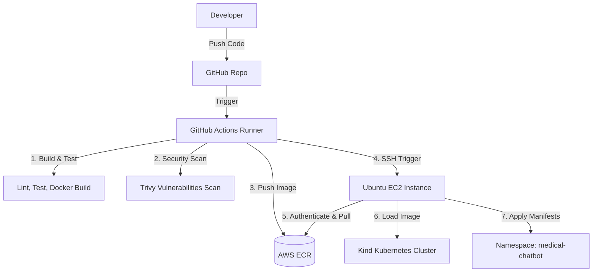
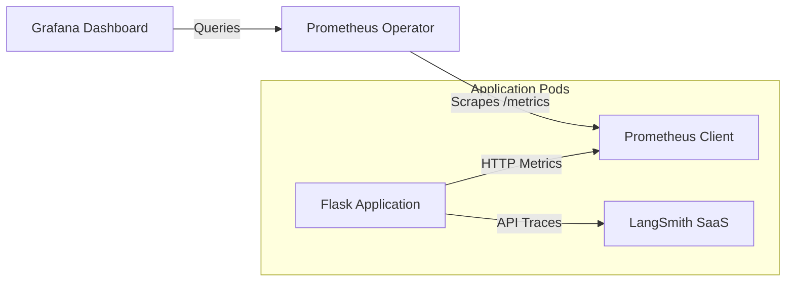

# Production-Grade Medical Chatbot: LLMs, RAG, Kubernetes, MLOps, & CI/CD Pipeline

[](https://www.python.org/)
[](https://flask.palletsprojects.com/)
[](https://kubernetes.io/)
[](https://aws.amazon.com/)
[](https://www.docker.com/)
[](https://prometheus.io/)
[](https://grafana.com/)
[](https://www.langchain.com/)
[](https://www.pinecone.io/)
[](https://www.langchain.com/langsmith)

An end-to-end, production-grade Retrieval-Augmented Generation (RAG) Medical Chatbot. This project transitions a domain-specific LLM application from a local prototype to a highly scalable, containerized, and monitored Kubernetes cluster running on AWS EC2, automated via GitHub Actions CI/CD.

---

## 📖 1. Project Overview

### What the Project Does
This project is an intelligent Medical Chatbot that allows users to ask domain-specific medical questions. The system retrieves relevant medical data from high-quality clinical documentation and textbooks (PDFs), contextually injects it into a Large Language Model (LLM) prompt, and returns accurate answers.

### Business Problem Solved
General-purpose LLMs hallucinate when asked niche, specialized, or technical medical questions. In healthcare settings, inaccurate guidance is unacceptable. This application mitigates hallucinations by restricting the LLM's generation boundaries to peer-reviewed, imported medical literature.

### Core Architecture Concepts
*   **Retrieval-Augmented Generation (RAG)**: Connects a static LLM to external datasets, enabling contextually relevant answers without expensive parameter fine-tuning.
*   **Pinecone Vector Database**: Indexes dense vectors generated from document chunks, enabling sub-millisecond similarity search across millions of medical records.
*   **LangChain**: Coordinates document loading, text splitting, vector indexing, prompt templates, and retrieval-based Q&A pipelines.

---

## 🏗️ 2. System Architecture

### RAG Inference Flow


### Deployment Pipeline Architecture


### Observability & Monitoring Topology


---

## 📁 3. Complete Folder Structure

```text
├── .github/
│   └── workflows/
│       └── deploy.yml          # GitHub Actions CI/CD Pipeline
├── data/                       # Raw source documents (PDFs)
├── k8s/                        # Production Kubernetes manifests
│   ├── configmap.yaml          # Non-sensitive runtime variables
│   ├── deployment.yaml         # App Pod specifications, replicas, health probes
│   ├── hpa.yaml                # Horizontal Pod Autoscaler policies
│   ├── ingress.yaml            # Ingress Nginx rules
│   ├── namespace.yaml          # Isolated namespace declaration
│   ├── secret.yaml             # API Credentials placeholders
│   └── service.yaml            # Internal Service load balancer
├── monitoring/                 # Monitoring configurations
│   ├── grafana-dashboard.yaml  # Grafana observability layout
│   ├── servicemonitor.yaml     # Custom metric scraper target definition
│   └── values.yaml             # Custom Prometheus Operator Helm values
├── research/                   # Jupyter notebooks for LLM experimentation
├── src/
│   ├── __init__.py
│   ├── helper.py               # Data loading, chunking, and embedding functions
│   └── prompt.py               # Prompt Engineering templates
├── static/                     # Web UI stylesheets & client scripts
├── templates/                  # Jinja2 Flask HTML structures
├── .dockerignore               # Patterns excluded from Docker build context
├── Dockerfile                  # Production multi-stage Docker build specification
├── README.md                   # Enterprise-ready project documentation
├── app.py                      # Flask main entrypoint & web routes
├── requirements.txt            # Project python dependencies
├── setup.py                    # Project packaging configuration
└── store_index.py              # Ingestion script to process PDFs and write vectors
```

---

## 💻 4. Technology Stack

| Component | Technology | Version | Purpose |
| :--- | :--- | :--- | :--- |
| **Backend** | Flask | `3.1.1` | Web application framework |
| **AI Orchestrator** | LangChain | `0.3.26` | RAG logic execution |
| **LLM Interface** | OpenAI GPT-4o | *SaaS* | Large Language Model |
| **Vector DB** | Pinecone | *Serverless* | Vector storage and lookup |
| **Embeddings** | HuggingFace | `all-MiniLM-L6-v2` | Generating 384-dimensional vectors |

| DevOps / Cloud | Technology | Version | Purpose |
| :--- | :--- | :--- | :--- |
| **Container Engine** | Docker | `24.x` | Packaging codebase |
| **Orchestration** | Kubernetes (Kind) | `v1.28` | Local and host cluster execution |
| **Cloud Provider** | AWS (EC2 & ECR) | *SaaS* | Hosting infrastructure & Docker Registry |
| **CI/CD Platform** | GitHub Actions | *SaaS* | Automation pipeline |

| Monitoring / MLOps | Technology | Version | Purpose |
| :--- | :--- | :--- | :--- |
| **Metrics Collector** | Prometheus | `v2.x` | Scraping app runtime telemetry |
| **Visualization** | Grafana | `10.x` | Graphing cluster dashboard |
| **LLM Observability** | LangSmith | *SaaS* | Tracing, debugging, cost-tracking prompts |

---

## ⚙️ 5. Local Development Setup

### Step 1: Clone the Repository
```bash
git clone https://github.com/bittush8789/Build-a-Complete-Medical-Chatbot-with-LLMs-LangChain-Pinecone-Flask-AWS.git
cd Build-a-Complete-Medical-Chatbot-with-LLMs-LangChain-Pinecone-Flask-AWS
```

### Step 2: Establish Python Environment
```bash
conda create -n medibot python=3.10 -y
conda activate medibot
```

### Step 3: Install Required Dependencies
```bash
pip install -r requirements.txt
```

### Step 4: Configure Local Environment Variable
Create a `.env` file in the root folder:
```env
PINECONE_API_KEY="your-pinecone-api-key"
OPENAI_API_KEY="your-openai-api-key"
LANGCHAIN_TRACING_V2="true"
LANGCHAIN_API_KEY="your-langsmith-api-key"
LANGCHAIN_PROJECT="medical-chatbot"
```

### Step 5: Process Source Medical Documents
Place reference medical textbook PDF files into `data/` and index them:
```bash
python store_index.py
```

### Step 6: Start Local Application Server
```bash
python app.py
```
Visit `http://localhost:8080` in your web browser.

---

## 🐳 6. Docker Setup

The application uses an optimized, multi-stage production Docker image built on top of `python:3.11-slim` with a non-privileged system user for maximum security.

### Build the Docker Image
```bash
docker build -t medical-chatbot:latest .
```

### Run the Container Locally
Ensure the API keys are injected at runtime:
```bash
docker run -d \
  -p 8080:8080 \
  -e OPENAI_API_KEY="your-openai-api-key" \
  -e PINECONE_API_KEY="your-pinecone-api-key" \
  -e LANGCHAIN_TRACING_V2="true" \
  -e LANGCHAIN_API_KEY="your-langsmith-api-key" \
  -e LANGCHAIN_PROJECT="medical-chatbot" \
  --name chatbot-container \
  medical-chatbot:latest
```

### Verify Container Health
```bash
docker ps
curl http://localhost:8080/health
```

---

## ☸️ 7. Kind Cluster Deployment

Kind (Kubernetes in Docker) allows running Kubernetes clusters locally using Docker containers as nodes.

### Setup Prerequisites
Follow the instructions to install [Docker](https://docs.docker.com/engine/install/), [kubectl](https://kubernetes.io/docs/tasks/tools/), and [Kind](https://kind.sigs.k8s.io/docs/user/quick-start/).

### Step 1: Create Kind Cluster
Apply the custom configuration mapping host ports 80/443 for ingress capability:
```bash
kind create cluster --config kind-config.yaml --name medical-cluster
```

### Step 2: Install Nginx Ingress Controller
```bash
kubectl apply -f https://raw.githubusercontent.com/kubernetes/ingress-nginx/main/deploy/static/provider/kind/deploy.yaml

# Wait for readiness
kubectl wait --namespace ingress-nginx \
  --for=condition=ready pod \
  --selector=app.kubernetes.io/component=controller \
  --timeout=90s
```

### Step 3: Load Docker Image into Cluster
Kind cannot pull directly from a local registry. You must push it manually:
```bash
kind load docker-image medical-chatbot:latest --name medical-cluster
```

### Step 4: Apply Kubernetes Manifests
Inject your base64-encoded credentials into `k8s/secret.yaml` first, then run:
```bash
kubectl apply -f k8s/namespace.yaml
kubectl apply -f k8s/secret.yaml
kubectl apply -f k8s/configmap.yaml
kubectl apply -f k8s/deployment.yaml
kubectl apply -f k8s/service.yaml
kubectl apply -f k8s/ingress.yaml
kubectl apply -f k8s/hpa.yaml
```

### Step 5: Verify Deployments
```bash
kubectl get pods -n medical-chatbot
kubectl get svc -n medical-chatbot
kubectl get ingress -n medical-chatbot
```

---

## 🏛️ 8. Kubernetes Architecture

```text
Incoming Traffic (Port 80/443)
      │
      ▼
 ┌──────────┐
 │ Ingress  │ (Ingress-Nginx Controller)
 └────┬─────┘
      │ Routes based on path "/"
      ▼
 ┌──────────┐
 │ Service  │ (ClusterIP Internal Load Balancer)
 └────┬─────┘
      │ Dispatches queries evenly
      ▼
 ┌──────────┐     ┌──────────┐
 │ Pod 1    │◄───►│ Pod 2    │ (Replica Pods configured with HPA)
 └──────────┘     └──────────┘
```

*   **Namespace**: Isolated workspace named `medical-chatbot`.
*   **Deployment**: Runs 2 replicas with RollingUpdate deployment strategy (minimizes downtime). Includes Liveness and Readiness probes configured at `/health`.
*   **ConfigMap**: Sets runtime variables such as tracing flags.
*   **Secret**: Injects sensitive API keys for OpenAI, Pinecone, and LangSmith.
*   **HPA**: Dynamically scales the pods up to 5 instances when CPU utilization averages 80%.

---

## ☁️ 9. AWS EC2 Setup

To host the Kind cluster in the cloud, prepare an Ubuntu 22.04 LTS (t3.medium or larger recommended) instance:

```bash
# Update Ubuntu package manager
sudo apt-get update -y && sudo apt-get upgrade -y

# Install Docker
curl -fsSL https://get.docker.com -o get-docker.sh
sudo sh get-docker.sh
sudo usermod -aG docker $USER && newgrp docker

# Install kubectl
curl -LO "https://dl.k8s.io/release/$(curl -L -s https://dl.k8s.io/release/stable.txt)/bin/linux/amd64/kubectl"
sudo install -o root -g root -m 0755 kubectl /usr/local/bin/kubectl

# Install Kind
curl -Lo ./kind https://kind.sigs.k8s.io/dl/v0.22.0/kind-linux-amd64
chmod +x ./kind
sudo mv ./kind /usr/local/bin/kind

# Install AWS CLI
sudo apt-get install unzip -y
curl "https://awscli.amazonaws.com/awscli-exe-linux-x86_64.zip" -o "awscliv2.zip"
unzip awscliv2.zip
sudo ./aws/install
```

---

## 📦 10. AWS ECR Setup

Amazon Elastic Container Registry stores your secure Docker images.

### Step 1: Create Repository
```bash
aws ecr create-repository --repository-name medical-chatbot --region us-east-1
```

### Step 2: Login to Registry
```bash
aws ecr get-login-password --region us-east-1 | docker login --username AWS --password-stdin <AWS_ACCOUNT_ID>.dkr.ecr.us-east-1.amazonaws.com
```

### Step 3: Tag and Push
```bash
# Tag for Git SHA or Latest
docker tag medical-chatbot:latest <AWS_ACCOUNT_ID>.dkr.ecr.us-east-1.amazonaws.com/medical-chatbot:latest

# Push
docker push <AWS_ACCOUNT_ID>.dkr.ecr.us-east-1.amazonaws.com/medical-chatbot:latest
```

---

## 🚀 11. GitHub Actions CI/CD

```text
[Push to main]
      │
      ▼
┌───────────────┐
│ Checkout &    │
│ Install Pip   │
└──────┬────────┘
       │
       ▼
┌───────────────┐
│ Docker Build  │
└──────┬────────┘
       │
       ▼
┌───────────────┐
│ Trivy Security│
│ Scan (Image)  │
└──────┬────────┘
       │
       ▼
┌───────────────┐
│ Push to ECR   │
└──────┬────────┘
       │
       ▼
┌───────────────┐
│ SSH to EC2 &  │
│ Deploy to Kind│
└───────────────┘
```

The CI/CD pipeline defined in `.github/workflows/deploy.yml` triggers on every merge to `main`. It tests code, builds a secure image, runs a Trivy vulnerability scan, pushes to Amazon ECR, and executes deployment scripts inside EC2 to load the image and apply Kubernetes configurations.

Required GitHub Repository Secrets:
*   `AWS_ACCESS_KEY_ID` & `AWS_SECRET_ACCESS_KEY`
*   `AWS_REGION`
*   `ECR_REPOSITORY`
*   `EC2_HOST` & `EC2_USER`
*   `EC2_SSH_KEY`
*   `BASE64_OPENAI_API_KEY`
*   `BASE64_PINECONE_API_KEY`
*   `BASE64_LANGCHAIN_API_KEY`

---

## 📊 12. Monitoring

We monitor cluster resource usage and custom application telemetry using **Prometheus Operator** and **Grafana**.

### Install Monitoring Infrastructure via Helm
```bash
helm repo add prometheus-community https://prometheus-community.github.io/helm-charts
helm repo update

# Install prometheus stack
helm install prometheus-stack prometheus-community/kube-prometheus-stack \
  --namespace monitoring \
  --create-namespace \
  -f monitoring/values.yaml

# Apply the custom ServiceMonitor and Dashboard config
kubectl apply -f monitoring/servicemonitor.yaml
kubectl apply -f monitoring/grafana-dashboard.yaml
```

### Metrics Monitored:
*   `container_cpu_usage_seconds_total`: Track CPU consumption.
*   `container_memory_working_set_bytes`: Monitor RAM usage per Pod.
*   `medical_chatbot_requests_total`: Tracks total API calls grouped by status and path.
*   `medical_chatbot_request_latency_seconds_bucket`: Logs prompt processing times.

---

## 🔍 13. LangSmith Observability

Integrating **LangSmith** enables deep observability for the RAG chain at runtime.

```text
User Query ──► Retriever Latency ──► LLM Call (Latency/Tokens) ──► Chatbot Response
   │                 │                        │                         │
   └─────────────────┴────────────────────────┴─────────────────────────┴──► Tracked in LangSmith
```

By exporting `LANGCHAIN_TRACING_V2=true`, LangSmith traces:
*   **Prompt Execution**: Inspects raw values fed into the templates.
*   **Retriever Latency**: Tracks search duration inside Pinecone index.
*   **LLM Latency**: Logs time elapsed waiting for OpenAI responses.
*   **Token Usage & Costs**: Monitored on a per-query basis.

---

## 🔒 14. Security Best Practices

*   **Kubernetes Secrets**: No plain keys are written in configurations. Everything is encoded as Base64 Opaque Secrets.
*   **Non-Root Execution**: Container process runs under user `appuser` (UID `10001`), ensuring that an application compromise does not grant system-level host control.
*   **Minimal Base Image**: Leverages `python:3.11-slim` to minimize the attack surface and vulnerabilities.
*   **Trivy Scanning**: Integrates a vulnerability scanner in the deployment pipeline to reject images containing Critical or High CVEs.

---

## 📈 15. Scaling Strategy

*   **Horizontal Pod Autoscaling**: Automatically handles spikes in traffic. If average CPU utilization exceeds 80%, the HPA scales replicas up to 5 instances.
*   **AWS EKS Migration**: For enterprise-scale production workloads, the local Kind cluster configuration can be directly migrated to Amazon EKS (Elastic Kubernetes Service) with minimal YAML manifest adjustments (such as adding AWS Load Balancer Controller annotations).

---

## 🔄 16. Development Workflow

1.  **Clone Repository**: Check out code locally.
2.  **Create Feature Branch**: `git checkout -b feature/your-feature-name`.
3.  **Make Changes**: Implement enhancements to UI or helper scripts.
4.  **Test Locally**: Start Flask app with python locally to check mechanics.
5.  **Build Docker Image**: Run `docker build -t medical-chatbot:test .`.
6.  **Deploy to Kind**: Load your local build into Kind and apply manifests (`kubectl apply -f k8s/`).
7.  **Commit Changes**: `git commit -am "Commit message"`.
8.  **Push to GitHub**: Push feature branch and open a Pull Request.
9.  **GitHub Actions Deployment**: Merge branch to `main` to trigger the CI/CD pipeline.
10. **Verify Deployment**: Verify deployment health inside EC2 via kubectl.

---

## 🚀 17. Deployment Workflow

```text
[Developer]
    │
    ├─► Commits code & pushes to GitHub
    ▼
[GitHub Actions Runner]
    │
    ├─► Validates YAML, builds image & runs Trivy vulnerability scan
    ├─► Authenticates to ECR & pushes new docker tags
    ▼
[AWS EC2 Host]
    │
    ├─► Pulls latest image tag from ECR
    ├─► Loads image into Kind cluster
    ├─► Applies namespace, configmap, secrets, deployment, & service
    ▼
[Kubernetes Namespace]
    │
    └─► Serves chatbot via Ingress-Nginx load balancer
```

---

## 🛠️ 18. Troubleshooting Guide

### Pod in `CrashLoopBackOff`
*   **Cause**: Missing or invalid credentials.
*   **Remedy**: Run `kubectl logs deployment/medical-chatbot -n medical-chatbot`. Ensure variables `OPENAI_API_KEY` and `PINECONE_API_KEY` are correct.

### Service returns 502 Bad Gateway
*   **Cause**: Nginx ingress controller cannot reach the backend pods, or pods are still starting up.
*   **Remedy**: Check the readiness probes status: `kubectl describe pod -n medical-chatbot`. If probes are failing, check `/health` response.

### Kind cannot pull Docker image
*   **Cause**: Inability to connect to external container registry.
*   **Remedy**: Ensure the image pull policy in `k8s/deployment.yaml` is set to `IfNotPresent` or `Never`, and make sure the image is loaded into Kind manually (`kind load docker-image medical-chatbot:latest`).

---

## 🔮 19. Future Enhancements

*   **GitOps with ArgoCD**: Continuous deployment using Git as the single source of truth.
*   **OpenTelemetry Integration**: Collect and forward traces to Datadog or Jaeger.
*   **Redis Caching Layer**: Cache frequent queries to reduce OpenAI API latency and cost.
*   **Multi-Agent Architecture**: Incorporate LangGraph agents to route queries to specialized medical calculators or triage workflows.

---

## 💼 20. Resume Impact

This project showcases expertise in high-demand MLOps, LLMOps, AI Platform, and DevOps engineering competencies:
*   **Containerization & Orchestration**: Kubernetes (Kind), production-ready multi-stage Docker builds.
*   **LLM Observability**: Prompt execution tracking and token usage monitoring using LangSmith.
*   **Infrastructure & CI/CD**: Cloud setup on AWS EC2 & ECR, automated build/test/scan deployment via GitHub Actions.
*   **System Observability**: Metric scraping and telemetry monitoring using Prometheus Operator & Grafana.
