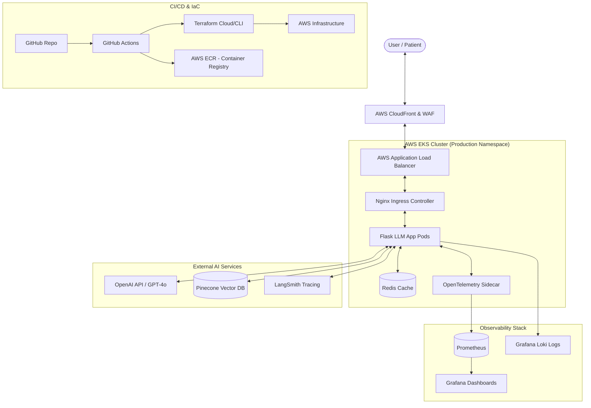

# 🏥 Enterprise Medical Chatbot: LLMOps & Production-Ready RAG

[](https://github.com/langchain-ai/langsmith)
[](https://aws.amazon.com/eks/)
[](https://www.terraform.io/)
[](https://kubernetes.io/)

This repository transforms a basic Medical Chatbot into a **Production-Grade Enterprise Application**. It implements the full LLMOps lifecycle, DevSecOps best practices, and a scalable cloud-native architecture on AWS.

---

## 🏗️ Production Architecture

The system is designed for high availability, security (HIPAA-compliant patterns), and observability.



---

## 🚀 Key Features

- **Enterprise RAG Pipeline**: Utilizing LangChain for sophisticated retrieval and OpenAI for empathetic, accurate medical responses.
- **Infrastructure as Code (IaC)**: Automated provisioning of VPC, EKS, and ECR using **Terraform**.
- **DevSecOps Pipeline**: Automated security scanning, multi-stage Docker builds, and automated deployments via **GitHub Actions**.
- **LLMOps Mastery**: Integration with **LangSmith** for prompt versioning, RAG evaluation, and hallucination detection.
- **Production Monitoring**: Full-stack observability with **Prometheus, Grafana, and Loki**.
- **Secure Networking**: SSL/TLS termination, AWS WAF protection, and IAM pod-level security (IRSA).

---

## 📂 Project Structure

```text
.
├── app/                # Core Application (Flask + LangChain)
├── terraform/          # Infrastructure as Code (AWS)
├── kubernetes/         # K8s Manifests (Deployment, Service, HPA)
├── docker/             # Production Dockerfiles
├── .github/            # CI/CD Workflows (GitHub Actions)
├── monitoring/         # Prometheus & Grafana Configs
└── docs/               # Detailed Documentation Suite
```

---

## 🛠️ Quick Start (Staging)

To run the enterprise stack locally for testing:

1. **Clone & Configure**:
   ```bash
   git clone https://github.com/your-repo/medical-chatbot.git
   cp .env.example .env  # Add your API Keys
   ```

2. **Launch with Docker Compose**:
   ```bash
   docker-compose up --build
   ```
   *The app will be available at `http://localhost:8080`*

---

## 📄 Documentation Index

Explore our detailed guides for every aspect of the project:

- 🏗️ **[Architecture Deep Dive](docs/DEPLOYMENT.md)**
- ⚙️ **[Installation Guide](docs/INSTALLATION.md)**
- 🚀 **[Implementation Guide](docs/IMPLEMENTATION_GUIDE.md)**
- 📈 **[Deployment Runbook](docs/OPERATIONS.md)**
- 🔒 **[Security & Compliance](docs/SECURITY.md)**
- 🤖 **[LLMOps Best Practices](docs/LLMOPS.md)**
- 💬 **[API Reference](docs/API_DOCS.md)**
- 💼 **[Career & Interview Prep](docs/INTERVIEW_PREP.md)**

---

## 🛡️ License
This project is licensed under the MIT License - see the [LICENSE](LICENSE) file for details.

---
**Disclaimer**: *This application is for educational and portfolio purposes. Always consult a qualified medical professional for health-related advice.*
